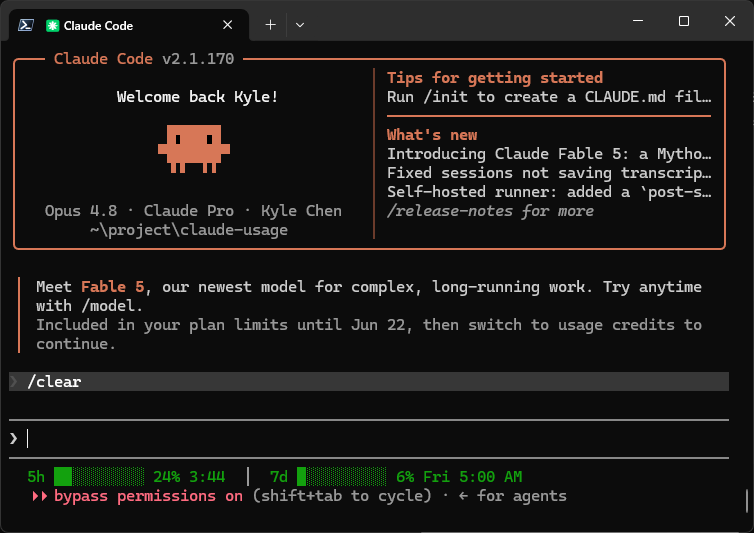

# Claude Code Usage Monitor — Rate Limit Tracker Plugin

[](LICENSE)
[](https://nodejs.org)
[](https://claude.ai/code)

A lightweight [Claude Code](https://claude.ai/code) plugin that tracks your **5-hour and weekly rate limit usage** in real time — displayed as a persistent status line at the bottom of the Claude Code interface.

```
5h ███░░░░░░░ 29% ready  │  7d ░░░░░░░░░░ 3% Fri 5:00 AM
```



Color-coded by usage: **green** < 50% · **yellow** 50–80% · **red** > 80%

> Reads data directly from Claude Code — no extra API calls, no token consumption.

---

## Why This Plugin?

Claude Code enforces a **5-hour rolling rate limit** and a **weekly token quota**. Without visibility into your usage, you can't tell how close you are to hitting a limit until Claude actually stops responding.

This plugin surfaces that information as a persistent, color-coded status line so you always know exactly where you stand — without leaving Claude Code or checking a separate dashboard.

---

## Installation

Run these three commands inside Claude Code:

<details>
<summary><strong>⚠️ Linux users: Click here first</strong></summary>

On Linux, `/tmp` is often a separate filesystem (tmpfs), which causes plugin installation to fail with:

```
EXDEV: cross-device link not permitted
```

**Fix**: Set TMPDIR before installing:

```bash
mkdir -p ~/.cache/tmp && TMPDIR=~/.cache/tmp claude
```

Then run the install command below in that session. This is a [Claude Code platform limitation](https://github.com/anthropics/claude-code/issues/14799).

</details>

```
/plugin marketplace add khchen-doit/claude-usage
/plugin install claude-usage
/reload-plugins
/claude-usage:setup
```

Then **restart Claude Code**. The usage status line appears at the bottom of the interface automatically.

---

## Requirements

- [Claude Code](https://claude.ai/code) v2.x+
- Node.js v18+

---

## How It Works

The plugin has two parts, configured so neither breaks when Claude Code updates the plugin or sweeps its cache:

**Stop hook (snapshot writer) — provided by the plugin itself.**
`hooks/hooks.json` declares a `Stop` hook that runs `claude_usage_hook.js` via the built-in `${CLAUDE_PLUGIN_ROOT}` placeholder. Claude Code re-resolves that placeholder to the _current_ plugin version on every launch, so the hook self-heals across updates and cache cleanup. It is loaded automatically when the plugin is enabled — nothing is written into `settings.json`. After each response it saves a snapshot to `~/.claude/usage_snapshot.json`, which `node claude_usage.js` reads to show the last known state outside an active session.

**statusLine (live display) — installed by `/claude-usage:setup`.**
Claude Code does not accept a `statusLine` from a plugin (only the main `settings.json` can define it), so `/claude-usage:setup` copies `claude_statusline.js` to a stable location at `~/.claude/claude-usage/` and points `settings.json` at that absolute path. Because the copy lives outside the volatile plugin cache, the status line keeps working even after the cache is swept. Claude Code calls it every 30 seconds, passing live rate-limit data as JSON on stdin; the script formats color-coded usage and outputs a right-aligned line.

> After updating the plugin, re-run `/claude-usage:setup` to refresh the stable statusLine copy. The hook needs no action — it updates itself.

---

## Project Structure

```
claude-usage/
├── .claude-plugin/
│   └── plugin.json          # Plugin manifest
├── commands/
│   └── setup.md             # /claude-usage:setup command (statusLine only)
├── hooks/
│   └── hooks.json           # Plugin-native Stop hook (auto-loaded, self-healing)
├── claude_statusline.js     # StatusLine script (run every 30s)
├── claude_usage_hook.js     # Stop hook — saves snapshot after each response
├── claude_usage.js          # Standalone display (outside Claude Code)
├── claude_bashrc.sh         # Optional shell integration
├── install.sh               # Optional shell integration installer (WSL/Linux/macOS)
└── install.ps1              # Optional shell integration installer (Windows)
```

---

## License

MIT
